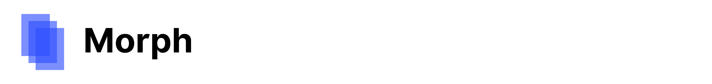

# 

A Flutter library for easily implementing Material Design navigation transitions.

## Examples

### Parent-child transition

You can use `MorphPageRoute` to create a parent-child transition between two screens.

```dart
import 'package:morph/morph.dart';

class MyList extends StatelessWidget {

  @override
  Widget build(BuildContext context) {
    return ListView.builder(
      itemCount: 10,
      itemBuilder: (context, index) {
        final _parentKey = GlobalKey();
        return ListTile(
          key: _parentKey,
          leading: CircleAvatar(child: Text((index + 1).toString())),
          title: Text('Item ${index + 1}'),
          onTap: () => _handleTap(context, _parentKey),
        );
      }
    );
  }

  void _handleTap(BuildContext context, GlobalKey parentKey) {
    Navigator.of(context).push(MorphPageRoute(
      child: Scaffold(),
      parentKey: parentKey,
      /// If you have a widget above [MyList], e.g. an
      /// [AppBar], you should set an offset.
      offset: kToolbarHeight,
    ));
  }

}
```

## Feature roadmap
- [ ] Parent-child transition
- [ ] Top-level transition
